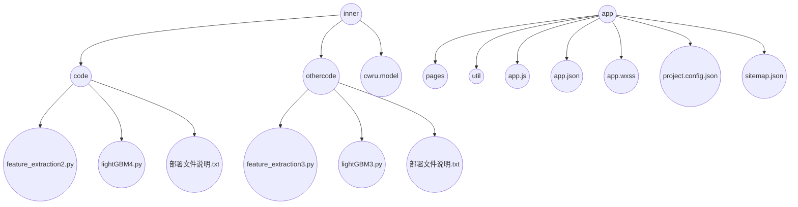

# phm项目文档
phm项目比赛数据的代码开源以及小程序工程的开源
## 项目概述
轴承故障诊断小程序（app文件夹），CWRU数据比赛代码（inner文件夹）
## 目录结构

## 依赖配置
小程序依赖配置：微信web开发者工具

CWRU比赛代码依赖配置：jupyter notebook

​                          需要环境：python3.7环境
​                          可能需要安装或更新的库：pandas，numpy，lightgbm，sklearn，scipy，os，pip

## 部署说明
小程序部署说明：

直接下载app文件夹，在微信web开发者工具上部署小程序。

CWRU比赛代码部署说明：

1.下载inner文件夹到指定位置，使用命令行打开jupyter notebook并在相应位置找到inner文件夹，对里面各个文件夹里的.py文件都可以进行修改和编译。

2.inner文件夹中有两个文件夹和一个.model文件。

3..model文件是已经封装好的机器学习模型,无法更改或编译。想要修改模型的参数可以在othercode文件夹中的lightGBM3.py文件进行修改。

4.code文件夹中存放的是用于CWRU比赛的数据预处理和特征提取的算法文件:feature_extraction2.py(可以对存放测试集142个文件的文件夹进行处理)以及调用lightGBM模型来输出结果result.csv文件的lightGBM4.py文件。

5.othercode文件夹中存放的是用于小程序里的数据预处理和特征提取的算法文件:feature_extraction3.py(对单个csv文件进行处理)以及用来封装lightGBM模型的lightGBM3.py文件(在该文件中修改模型的参数再完成封装可以生成新的.model文件用于调用)。

## 运行说明
小程序执行:运行小程序后根据界面的提示点击按钮或输入内容便可运行。

CWRU比赛代码执行:

1.在jupyter notebook中打开code文件夹下的feature_extraction2.py,需要修改的参数为data_path和save_path，data_path改为存放TEST1-TEST142这142个csv文件的文件夹cwru的路径，save_path改为输出文件的目标路径。

2.接着运行lightGBM4.py文件,需要更改三个参数
model改为cwru.model存放的路径
test改为运行feature_extraction2.py后输出的特征文件路径
opath为输出result文件的目标路径。

## 注意事项
CWRU比赛代码执行注意事项:

1.feature_extraction2.py使用了os.listdir函数，因此输入参数必须为一个文件夹，它是对cwru文件夹下的所有TEST文件进行遍历然后数据预处理和特征提取的，如果对单个TEST文件进行特征提取可以使用othercode文件夹内的feature_extraction3.py文件。

2.feature_extraction2.py使用了pandas包中的ptp函数，这个函数在较新的pandas包中被移除了，因此需要安装版本为0.25.3及之前的pandas包才能运行，造成不便请谅解。

小程序代码执行注意事项:

暂无注意事项。